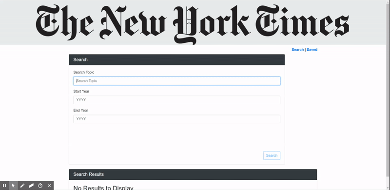

# NYT-React-Search
A MERN Stack application. This applications is React-based rendition of the New York Times Article Search. Motivation of this application is to create React components, work with helper/util functions, and utilize the React mounting life cycle to query and display articles based on user searches. Also, I used Node, Express and MongoDB so that users can save articles to read later.

### A View From the Application
* Please check out the deployed version in Heroku <a href="https://lit-thicket-50089.herokuapp.com/">Click Me !!!</a>

## Technologies Used

* The frontend, the app uses *ReactJS* for rendering components, *axios* for internal/external API calls, and *bootstrap* as a styling framework.
* The backend, the app uses *express.js* to serve routes and *mongoose* to interact with a *MongoDB* database.

